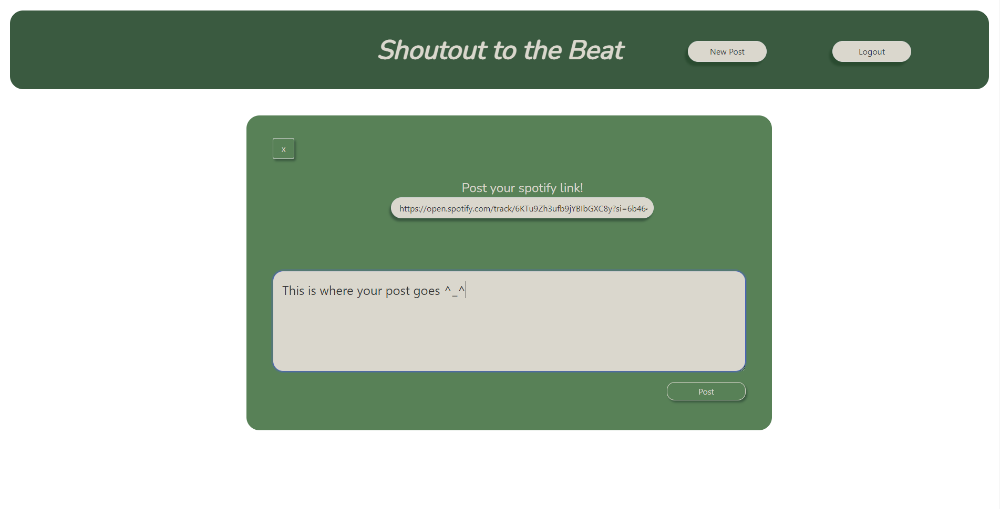

# Music-Blog
A blog all about peoples favorite songs!

 ## Table of Contents
- [Description](#Description)
- [Installation](#Installation)
- [Usage](#Usage)
- [Contributions](#Contributions)
- [Features](#Features)
- [License](#License)
- [ScreenShots](#ScreenShots)
- [Credits](#Credits)

## Description
We created this project because we love music and wanted to know what kinds of music other people like to listen to. This webpage allows users to post a song with a link, making it a great way for people to find songs or artists they never heard of before.

## Installation

N/A

## Usage

Simply visit our webpage: https://mysterious-gorge-44175-06939e93d547.herokuapp.com/  
It can be used to post a favorite song of yours.  
Once you log-in or sign-up, you can click the 'new post' button and will be able to provide a spotify link and comment  
After you have added a link and commented what you want, click the post button.  

## Contributions

Corey - https://github.com/gulledgecorey  
Alicia - https://github.com/foxeyb28  
Kasey - https://github.com/brownKasey  
Bradley - https://github.com/SandersonHub  

## Features

Our webpage includes a signup/login page so that you can have an account.

Has a post section so that you can post your favorite song for others to see. Along with the post it will have a link to the song on spotify so people can listen to the song.

## License

This project is using the Mit License.

## ScreenShots

### Login

### SongPost

### New-Post

## Credits

Bulma documentation https://bulma.io/documentation/overview/start/ . We used bulma to style our handlebars.

The use of a Spotify api https://www.npmjs.com/package/spotify-url-info . With this api we are able to get the song data for people to post on the webpage.

https://www.youtube.com/watch?v=L5WWrGMsnpw Helped style the login and signup css.

Our TA Jessica she guided us in the right direction every class and she helped out so much with errors in our routes on insomnia and helped out a lot with the handlebars. She also took time to do one on one work to help out.

The University of Minnesota bootcamp, we took a lot of inspiration from 14-MVC's mini project especially with the handlebars, routes and the standard file structures.
