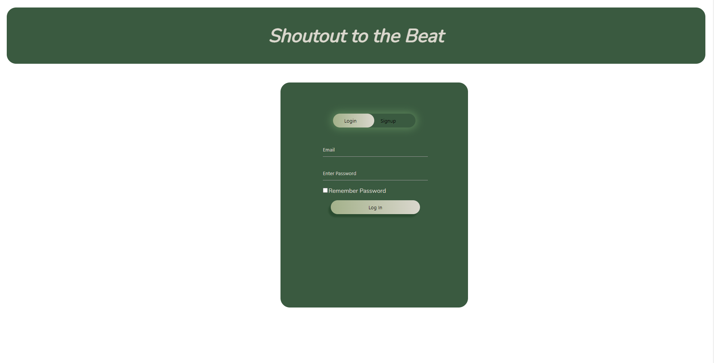
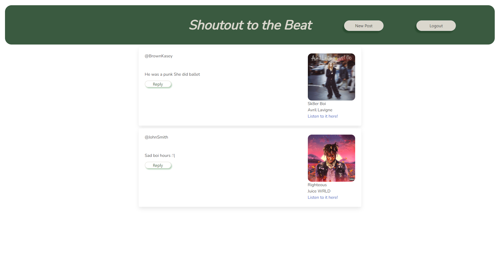

# Music-Blog
A blog all about peoples favorite songs!

 ## Table of Contents
- [Description](#Description)
- [Installation](#Installation)
- [Usage](#Usage)
- [Contributions](#Contributions)
- [Features](#Features)
- [License](#License)
- [ScreenShots](#ScreenShots)
- [Credits](#Credits)

## Description
We created this project because we love music and wanted to know what kinds of music other people like to listen to. This webpage allows users to post a song with a link, so that others can comment about the song. Making it a great way for people to find songs or artists they never heard of before.

## Installation

N/A

## Usage

Simply visit our webpage https://mysterious-gorge-44175-06939e93d547.herokuapp.com/ . It can be used to post a favorite song of yours and and then people can leave comments on the post to let you know what they think about it and vice versa.

## Contributions

Corey - gulledgecorey  
Alicia - foxeyb28  
Kasey - brownKasey  
Bradley - SandersonHub  

## Features

Our webpage includes a signup/login page so that you can have an account.

Has a post section so that you can post your favorite song for others to see. Along with the post it will have a link to the song on spotify so people can listen to the song.

Has a comments section so that you or other people can leave comments on other peoples favorite songs and let them know what you think about it.

## License

Please refer to license in the repo.

## ScreenShots

### Login

### SongPost

## Credits

Bulma documentation https://bulma.io/documentation/overview/start/ . We used bulma to style our handlebars.

The use of a Spotify api https://www.npmjs.com/package/spotify-url-info . With this api we are able to get the song data for people to post on the webpage.

Our TA Jessica she guided us in the right direction every class and she helped out so much with errors in our routes on insomnia and helped out a lot with the handlebars. She also took time to do one on one work to help out.

The University of Minnesota bootcamp, we took a lot of inspiration from 14-MVC's mini project especially with the handlebars, routes and the standard file structures.
